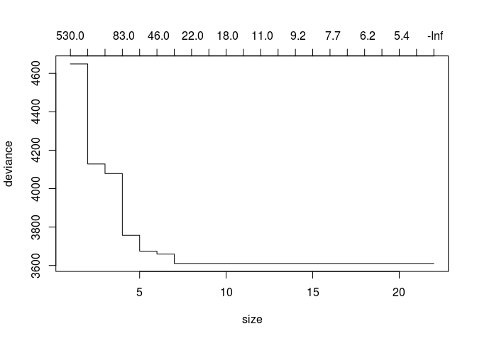
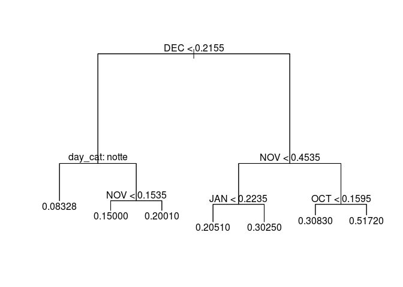

Previsione di domanda e prezzo di elettricità e gas per mezzo di modelli
di machine learning
================

Procediamo con la lettura dei dati. Il dataset si riferisce ai consumi
di energia elettrica di un campione di clienti. Scopo delle analisi è
quello di prevedere il consumo di Febbraio sulla base dei mesi
precedenti.

Procediamo con la lettura dei dati

``` r
rm(list=ls())
dat=read.csv(unzip("./dati.zip","energia_clean.csv"))
```

È disponibile la variabile `h` che contiene informazioni sull’orario del
quale le rilevazioni sono state effettuate. Per valutare l’impatto dei
diversi momenti della giornata sul consumo di energia elettrica,
trasformiamo tale variabile numerica in una variabile categoriale in cui
le diverse modalità rappresentano le differenti fasce orarie.

``` r
require(lubridate)
day_cat = hour( as_datetime(dat$h) )
new_hour = numeric(length(day_cat))
new_hour[day_cat < 6] = "notte"
new_hour[day_cat >= 6 & 
           day_cat < 13] = "mattina"
new_hour[day_cat >= 13 & 
           day_cat < 19] = "pomeriggio"
new_hour[day_cat >= 19] = "sera"
```

Rimuoviamo ora i dati mancati e creiamo un’altra variabile risposta il
cui valore è \(log(FEB)\) in caso di consumi positivi e \(0\) in caso di
consumi nulli. Rimuoviamo poi le variabili che non utilizzeremo per le
analisi.

``` r
dat$day_cat = factor(new_hour)
dat =  na.omit(dat)
dat$FEB_L = log(dat$FEB)
dat$FEB_L[is.infinite(dat$FEB_L)] = 0 
dat$u = NULL
dat$h = NULL
dat$X = NULL
```

Dividiamo i dati in insieme di stima ed insieme di verifica.

``` r
set.seed(1234)
stima = sample(1:NROW(dat), .75*NROW(dat))
verifica = setdiff(1:NROW(dat), stima)
dat_stima = dat[stima,]
dat_verifica = dat[verifica,]
NROW(dat_stima) + NROW(dat_verifica) 
```

    ## [1] 220824

``` r
NROW(dat)
```

    ## [1] 220824

Procediamo quindi con la stima di un albero di regressione per prevedere
in consumo di febbraio in funzione dei consumi passati.

``` r
require(tree)
f0 = as.formula(paste0("FEB~",paste0(names(dat_stima)[2:6], collapse = "+")))

# Comando di base
m0 = tree(f0,
      data = dat_stima, 
      control = tree.control(nobs=length(stima), minsize = 2,mindev = 0.001))

# Convalida incrociata
cv_tree = cv.tree(m0)
plot(cv_tree)
```

<!-- -->

``` r
m_final = prune.tree(m0,best = 7)


plot(m_final)
text(m_final,pretty=0)
```

<!-- -->

``` r
### valutare previsione
p0 = predict(m_final,dat_verifica)
(mse_tree = mean((dat_verifica$FEB - p0)^2))
```

    ## [1] 0.02185855

Nel file `lab1.R` è contenuto tutto il codice per riprodurre questi
risultati ed estendere le analisi a modelli di tipo bagging e foreste
casuali. Il file `lab2.R` effettua delle analisi simili utilizzando le
reti neurali.
